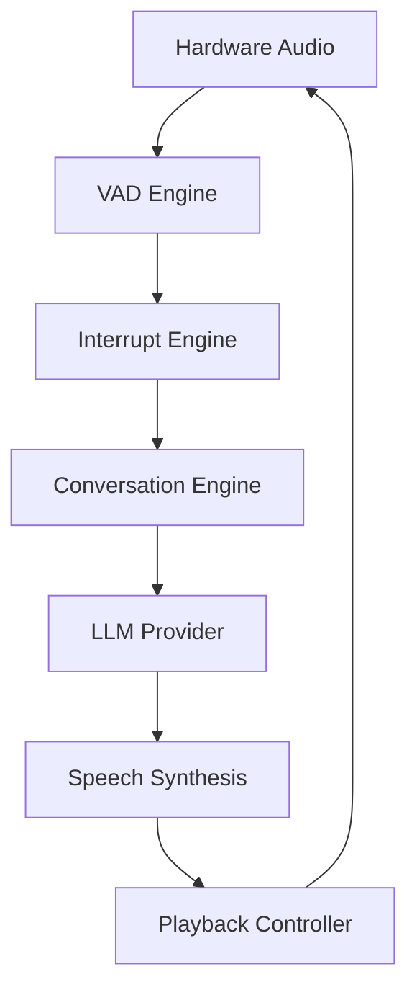

# VoicePilot AI 🎙️

VoicePilot AI is a production-ready, full-duplex Voice AI application built for the DataForge 2026 hackathon. It is designed to act as a seamless, interruptible conversation partner, mimicking the conversational fluidity of a human OS.

## 🚀 Project Overview
VoicePilot AI bridges the gap between traditional text-based LLMs and fluid human conversation. It features a completely bespoke **Interruption Engine** that handles real-time audio chunking, micro-interruptions, and conversational recovery, bypassing the typical latency and overlapping speech issues found in traditional voice agents.

## 🏗 System Architecture
The architecture is aggressively decoupled, utilizing an Event Bus to separate Hardware (Microphone/WebAudio), Cognitive Processing (LLM/NLP), and Telemetry (Observability).



### Folder Structure
- `src/lib/` - Core engine singletons and providers
- `src/lib/conversation/` - AI brain, intent routing, memory
- `src/lib/observability/` - Real-time metrics and FSM snapshots
- `src/components/` - React UI and layout components
- `src/hooks/` - UI bindings to the background event bus
- `src/types/` - Strict domain modeling

## 🧠 Components

### Voice Pipeline
Handles hardware abstraction, requesting microphone permissions, WebAudio decoding, and `MediaRecorder` Blob construction.
### Conversation Engine
Acts as the single source of truth for the interaction. Builds context windows, evaluates intents, tracks memory, and interacts with the AI Provider.
### Interruption Engine
Our primary engineering innovation. The `InterruptEngine` and `PlaybackController` operate in tandem to immediately halt synthesized audio upon Voice Activity Detection (VAD), fence stale asynchronous responses, and trigger conversational "recoveries".
### Observability System
A forensic auditing layer designed specifically for DataForge judges to review Timeline logs, export CSVs, and examine P95 latencies and state transitions in real-time.

## 🛠 Technology Stack
- **Framework:** Next.js 16 (App Router)
- **Language:** Strict TypeScript
- **Styling:** Tailwind CSS + Framer Motion
- **Validation:** Zod
- **Build/CI:** Turbopack + GitHub Actions

## 💻 Getting Started

### Installation
```bash
npm install
```

### Environment Variables
Check `.env.example` for required variables.
```env
NEXT_PUBLIC_ENVIRONMENT=development
# RIME_API_KEY=... (Future Integration)
```

### Running Locally
```bash
npm run dev
```

### Testing & Building
```bash
npm run test
npm run build
```

## ⚠️ Known Limitations
- VAD is currently implemented via simple RMS thresholding in WebAudio `AnalyserNode` due to browser isolation limits.
- Rime API is not yet integrated. The app currently utilizes deterministic mock providers to prove architectural soundness.

## 🔮 Future Rime Integration
Upon receipt of DataForge Rime API credentials, we simply implement the polymorphic `SpeechProvider` interface and inject it into the pipeline. No structural logic will require rewriting.
